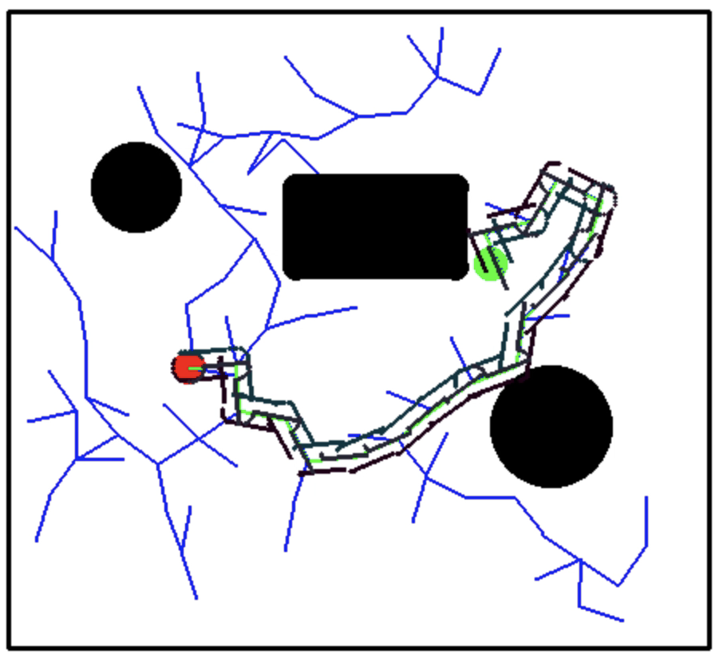
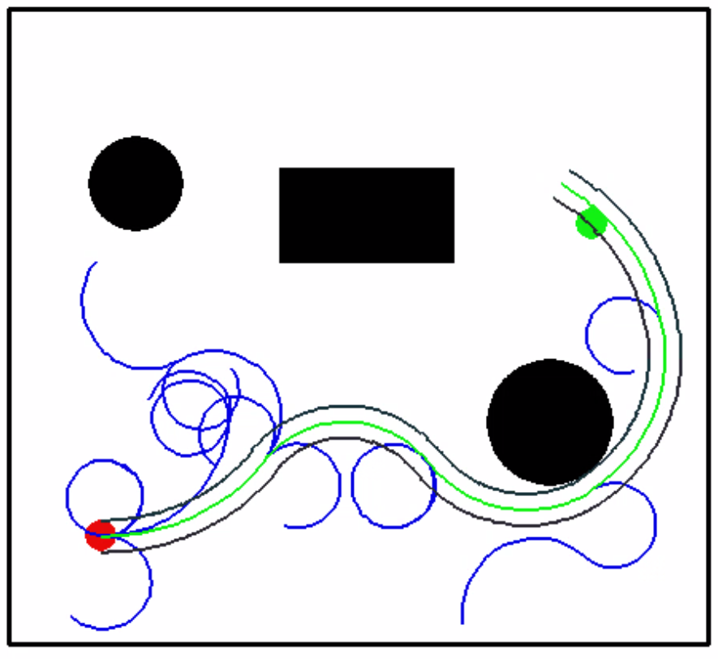
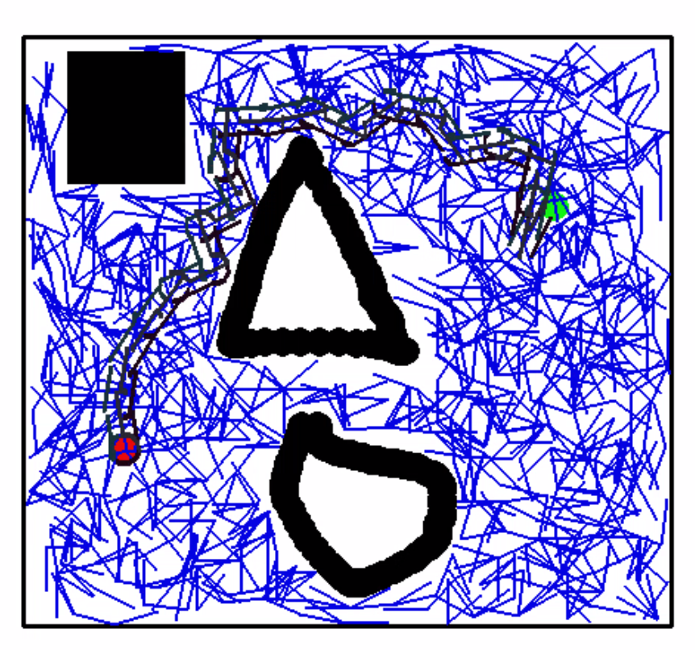

# Robotic Path Planning with Rapidly-exploring Random Tree (RRT)

Implementation of the RRT algorithm with pygame interface for:
- Holonomic Robot
- Non-Holonomic Robot

A robot is to navigate a two dimensional space, avoiding known locations with obstacles, traveling from its initial location to a goal location. Given localization information (robot’s initial position, obstacle location, goal location), the task is to implement a path planning decision maker to drive the robot from its initial position to the desired location.

Specifically, the problem can be formed as follows: Consider a 2D grid instantiated with different kinds of obstacles (for instance, geometrical shapes like Rectangles, Circles, Triangles or a combination of any of the above 2/3). 

## RRT Algorithm
* The RRT Algorithm is a sampling-based path planning algorithm which randomly samples points in the environment and adds them to a tree based data structure. 

* They search high dimensional spaces by incrementally building random tree from random samples. The process of building a RRT and finding a path from starting to goal configuration can be broken down into simple steps:
    1. Sample a random point within the environment
    2. Find the node in the tree which is nearest to the random point and check for collisions with obstacles
    3. Extend the tree towards the random point
    4. Repeat steps 1 to 3. Stop iteration on reaching goal or within a threshold of the goal

## How to Run:
1. Install PyGame 1.9.4 module in Python 3
2. run python3 <filename.py> and choose the filename accordingly
    - **Holonomic robot with fixed obstacles** - run RRT_holonomic.py / RRT-Holonomic-Robot.ipynb 
    - **Holonomic robot with hand drawn obstacles** - RRT_holonomic_drawn.py
    - **Non Holonomic robot with fixed obstacles** - run RRT_nonholonomic.py / RRT-Non-Holonomic-Robot.ipynb 
    - **Non Holonomic robot with hand drawn obstacles** - RRT_nonholonomic_drawn.py
3. When the UI window opens, click on the buttons and place the start, finish point and the draw the obstacles
4. Then view the RRT graph evolution of the robot along with the center and wheel trajectories

## Working of RRT for holonomic case
* We used a three wheeled omnidirectional robot for implementing RRT algorithm for the holonomic case. The robot with a radius of 8 units and has three wheels aligned at an angle of 120 degrees from each other. 
* We used pygame interface to for custom selection of start and goal points. 
* For obstacle detection, we checked the intensity of all points in the RRT path and did not add the node to the RRT tree if black in color(obstacle).
* Additionally, we also make sure the node is within the boundary
* To find the RRT path, we used backtracking of all the parent nodes in the tree structure. 
* We also find the wheel trajectories for all three wheels of the robot by following the RRT path.
    

## Working of RRT for non-holonomic case
* We used a differential drive robot for implementing RRT algorithm for the holonomic case. The robot with a length of 20 units and has two wheels aligned at an angle of 180 degrees from each other. 
    **Differential Drive**
* These robots have two wheels and the controllable parameters are velocity v and angular velocity omega
* Velocities v_x and v_y are not decoupled. They are coupled through the robot's instantaneous direction theta

* **Differential Drive Equations**
  - v_cx(t) = v*cos(omega * t)
  - v_cy(t) = v*sin(omega * t)
  - v_cy(t) = v_cx(t)*tan(omega * t)

* We used pygame interface to for custom selection of start and goal points. 
* For obstacle detection, we checked the intensity of all points in the RRT path and did not add the node to the RRT tree if black in color(obstacle).
* Additionally, we also make sure the node is within the boundary
* To find the RRT path, we used backtracking of all the parent nodes in the tree structure. 
* We also find the wheel trajectories for the two wheels of the robot by following the RRT path.
    

## RRT with Pygame Hand drawn obstacles
   

## Videos of evolution of RRT tree with center velocity and wheel trajectories. 
- [Holonomic robot with fixed obstacles](https://www.youtube.com/watch?v=a4b-kEUc80w)
- [Holonomic robot with hand drawn obstacles](https://www.youtube.com/watch?v=poVOsSNdEg4) 
- [Non Holonomic robot with fixed obstacles](https://www.youtube.com/watch?v=e1S03ds0wJY)
- [Non Holonomic robot with hand drawn obstacles](https://www.youtube.com/watch?v=SwrZ-Usj5HA)

